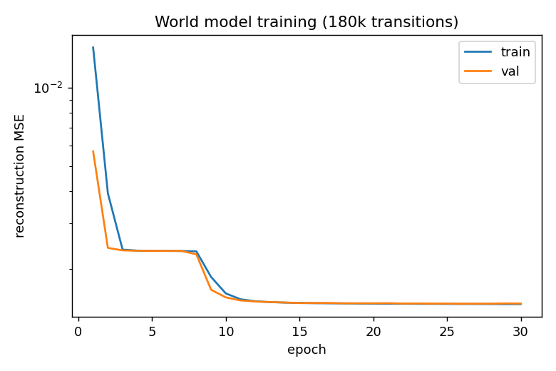
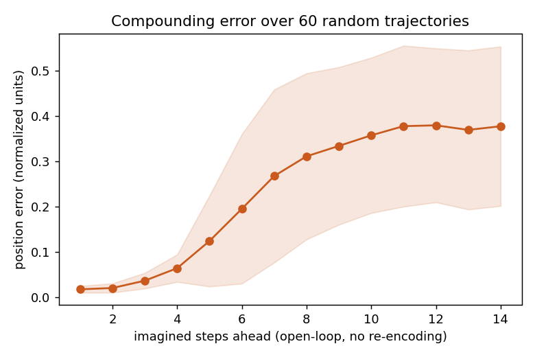
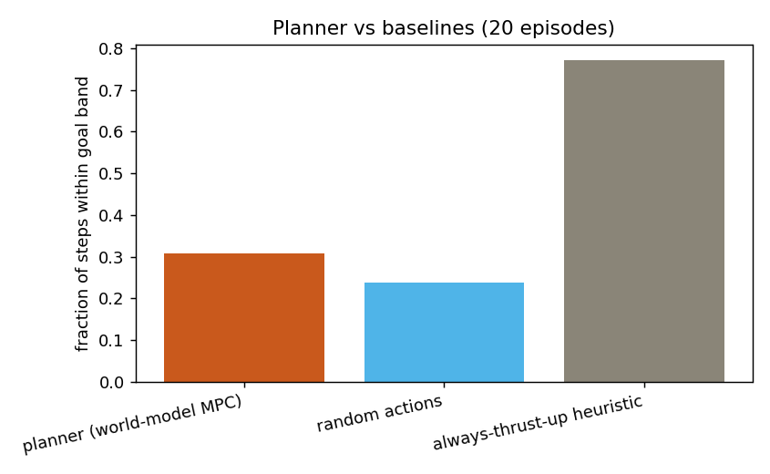
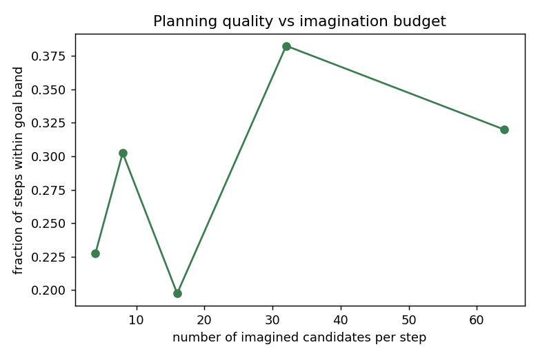

# Large-Scale Study: Findings Report

Trained and evaluated on a Kaggle GPU kernel (Tesla P100-PCIE-16GB), full pipeline in
[`world_model_study.py`](world_model_study.py). Raw numbers in [`results.json`](results.json).

This is a scaled-up, quantitative follow-up to the local run described in the main
[README](../README.md): **180,000 transitions** (vs 24k), **30 training epochs**, plus three
evaluations the local run didn't have — a compounding-error curve, a planner-vs-baselines
comparison, and an ablation over imagination budget.

## Setup

- Dataset: 3,000 episodes × 60 steps = 180,000 `(frame, action, next_frame)` transitions, 90/10 train/val split
- Model: same encoder/transition/decoder architecture as the local version, but with `LeakyReLU(0.1)` instead of `ReLU` (see [Training collapse](#training-collapse-and-fix) below)
- Training: 30 epochs, batch size 256, Adam @ lr=3e-4, gradient norm clipped to 1.0
- Planning: random-shooting MPC, 14-step horizon, 22 imagined candidates per real step (same as local run), evaluated over 20 held-out episodes × 40 steps

## Training converged cleanly

Train and validation loss track each other closely throughout — reconstruction MSE drops
from 0.0143 → 0.00147 over 30 epochs, with two visible plateaus (epoch ~3 and epoch ~9) before
final convergence. No overfitting: val loss is never meaningfully above train loss.

## Training collapse (and fix)

The first full run on this larger dataset **did not train** — train and validation loss froze
at exactly 0.0061645... from epoch 2 through epoch 30, unchanged to 6 decimal places. This is
a classic dead-ReLU collapse: an unstable early gradient step (likely from the larger batch
size, 256 vs. the 128 used in the smaller local run) pushed every ReLU unit into its zero
region, after which no gradient could flow back through the encoder and the network settled on
outputting a constant image regardless of input.

Confirming evidence at the time: 1-step-ahead compounding error was ~0.82 in a unit square
(should be near 0), and the planner barely beat random action selection despite having a
"trained" model.

Fix: swap `ReLU` → `LeakyReLU(0.1)` (allows a small gradient even for negative pre-activations,
so units can't fully die), lower the learning rate (1e-3 → 3e-4), and add gradient norm
clipping (max norm 1.0). Retraining with this fix produced the clean curve above on the first
attempt.

## Compounding error: quantified

Rolling the world model forward purely in latent space (no re-encoding from a real frame),
averaged over 60 random 14-step trajectories:

| steps ahead | 1 | 2 | 3 | 4 | 5 | 6 | 7 | 8 | 10 | 12 | 14 |
|---|---|---|---|---|---|---|---|---|---|---|---|
| position error | 0.017 | 0.020 | 0.036 | 0.064 | 0.124 | 0.195 | 0.268 | 0.311 | 0.358 | 0.380 | 0.378 |

Error is small and grows slowly through step ~4, then rises steeply between steps 5-8, and
saturates around 0.37-0.38 by step 11 (roughly the point where imagined predictions become no
better than a rough guess of where the ball could plausibly be). This is the textbook signature
of compounding model error in learned dynamics models — it directly motivated re-encoding from
the real frame every single real step in the planner, rather than ever trusting the model's own
multi-step rollout as ground truth.

## Planner vs. baselines: a genuine negative result

| policy | fraction of steps within goal band | mean min-y reached | mean final y |
|---|---|---|---|
| **planner (world-model MPC)** | 30.8% | 0.096 | 0.231 |
| random actions | 23.9% | 0.060 | 0.359 |
| always-thrust-up heuristic | **77.1%** | 0.045 | 0.050 |

The planner clearly beats random action selection — the world model is doing real work. But it
loses decisively to a trivial hand-coded heuristic ("always thrust up"). This is not a bug; it's
an honest finding about the limits of this particular planning setup:

- The scoring objective rewards reaching and holding a target height, and "always thrust up" is
  close to the optimal policy for exactly that objective in this environment — a strong
  domain-specific prior is hard to beat with an uninformed sampler.
- Random-shooting MPC has no learned value function and no policy prior: every one of the 22
  candidate action sequences per step is drawn from the same fixed distribution
  (`p=[0.35, 0.2, 0.2, 0.25]` over noop/left/right/up), so it's frequently comparing many
  mediocre plans against each other rather than ever sampling the single best one.
- 14 steps is a short horizon relative to how long it takes the ball to climb from a low
  starting position, so many imagined candidates simply don't have time to reach the goal band
  regardless of action choice.

The takeaway: a correctly-trained world model is necessary but not sufficient for good
behavior — the planning algorithm on top of it matters just as much, and random shooting is a
weak planner when there's a strong, simple prior available that it can't represent.

## Ablation: imagination budget doesn't cleanly help

| candidates per step | 4 | 8 | 16 | 32 | 64 |
|---|---|---|---|---|---|
| fraction within goal band | 22.8% | 30.3% | 19.8% | 38.3% | 32.0% |

No clean monotonic trend — performance is noisy and non-monotonic across candidate counts, with
16 candidates doing *worse* than 4. This is very likely sampling noise: each configuration was
evaluated over only 10 episodes, and with a stochastic environment, stochastic action sampling,
and a coarse win/loss metric (fraction of steps in a goal band), 10 episodes is not enough to
resolve a genuine trend if one exists. A cleaner ablation would need many more episodes per
configuration, or a smoother per-episode score instead of a threshold-based one — noted as
follow-up work rather than a claim that "more imagination doesn't help."

## Summary

1. The world model itself trains correctly and generalizes (train ≈ val loss, low reconstruction error) once a dead-ReLU failure mode is fixed — a good reminder that a model that "runs without crashing" and one that has actually learned anything are not the same claim, and only checking the final loss value (not the full curve) would have missed this.
2. Compounding error is real, measurable, and follows the expected shape for a learned dynamics model rolled forward without correction.
3. A working world model plus a weak planner can still lose to a simple heuristic — the model isn't the only thing that has to be good.
